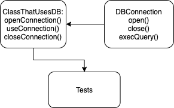

# Задание 32.6.1

**Задание:** создать тесты с моком объекта, имитирующим подключение к базе данных.

**Подробнее:** напишите реализацию классов (которые будут участвовать в тестах), как показано на схеме:

